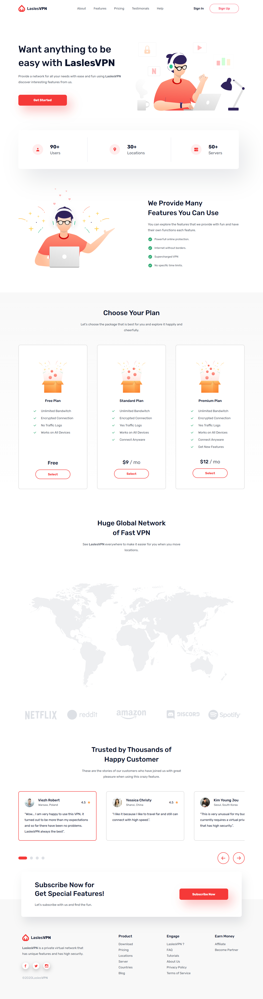
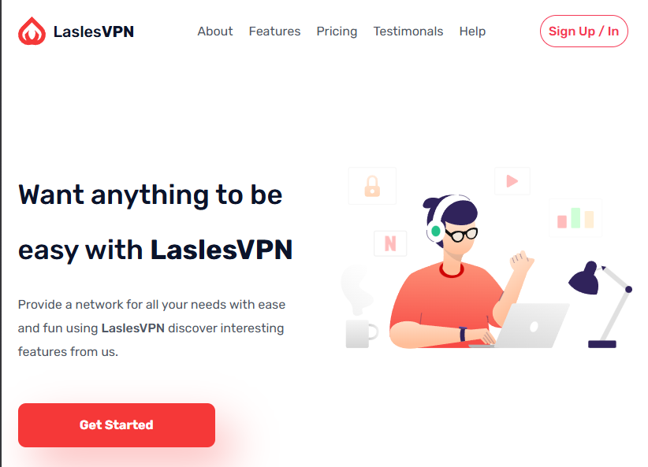

# LaslesVPN Website

A responsive website built with **HTML** and **CSS**, inspired by a Figma design of the LaslesVPN application.  
This project was part of my **Frontend Diploma** at [Almdrasa](https://almdrasa.com), and it helped me deepen my understanding of layout, styling, and responsive design.

---

## 🚀 Overview

I created this project to practice and apply what I’ve learned in HTML and CSS, and to explore new techniques such as:
- **Flexbox** and **CSS Grid**
- **Pseudo-classes** like `:has()`
- **Animations and transitions**
- **Responsive design for all devices**
- **Using SASS for cleaner and more modular CSS**

This project also helped me improve my **research skills** and learn how to debug and structure larger projects.

---

## 💡 Features

- Built using **HTML5** and **CSS3 (SASS)**
- **Fully responsive** layout
- **Smooth animations**
- **Modern, clean design**
- **Based on a Figma design**

---

## 🧩 Process

1. Planned the full page structure.
2. Prepared all assets (images, icons, and logos).
3. Built the structure using semantic HTML.
4. Styled each section with CSS and SASS.
5. Added animations and made it responsive.
6. Tested on multiple screen sizes.

---

## 🙏 Acknowledgments

- **Almdrasa** for providing the project as part of the Frontend Diploma.
- **Mohamed Abusrea** for his clear explanations and sharing his real-world experience in HTML & CSS.
- **AI tools** (like ChatGPT) for guidance and learning support throughout the project.

---

## 🎯 Next Steps

I’m now starting my **JavaScript learning journey**, aiming to make more dynamic and interactive websites in the future!

---

## 🖼️ Preview

### 🖥️ Desktop Version

### 📱 Mobile Version

### 📱 Tablet Version

---

## 🔗 Live Demo

[View Live Website](https://omarhazem02.github.io/laslesVPN-website-project/) 

---

**Built with ❤️ by Omar Hazem**
